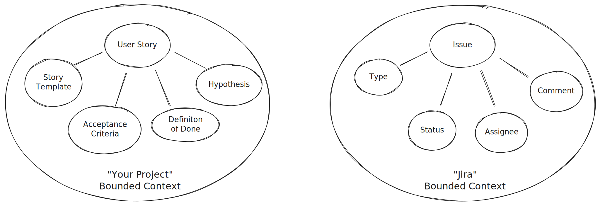
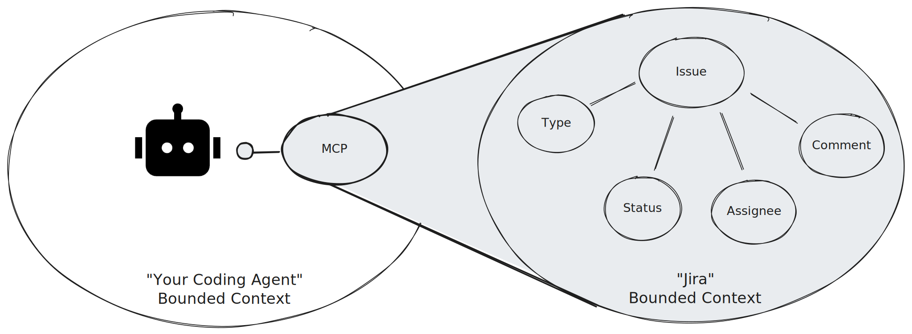
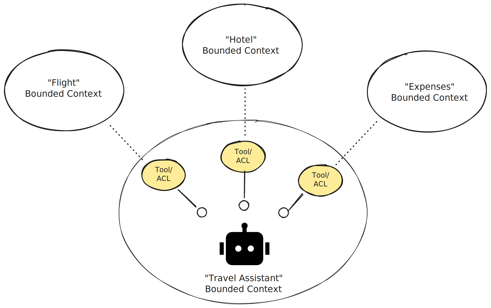
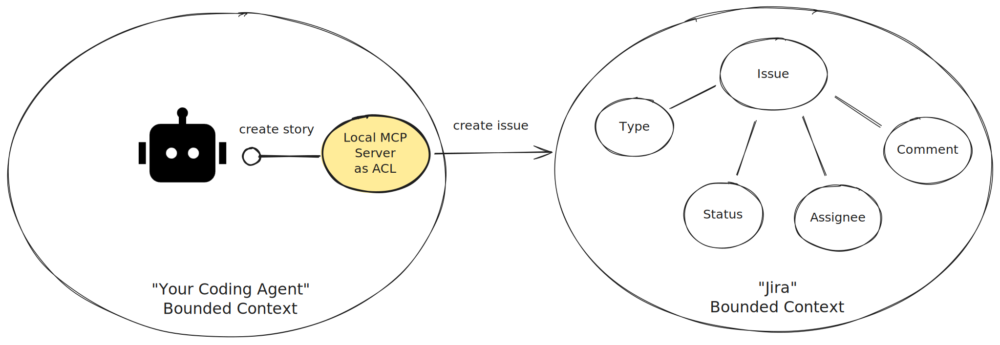

You have likely heard the narrative that the [Model Context Protocol (MCP)](https://modelcontextprotocol.io/docs/getting-started/intro) is the "USB-C port" for integrating external systems with AI applications. It's a compelling metaphor, but it has led many to view MCP as a universal adapter for all AI architecture; resulting in [widespread overuse](https://www.thoughtworks.com/en-de/radar/techniques/summary/mcp-by-default).

To stretch that analogy to its logical conclusion: USB-C is a fantastic protocol for connecting external peripherals to your local laptop, but you wouldn't use raw, exposed consumer cables to wire up the core routing infrastructure of an enterprise data center. Similarly, while MCP is essential for supercharging local coding assistants, exposing unmediated upstream schemas directly to an LLM's system prompt introduces massive semantic risk. It was never designed to serve as the primary architecture for a complex, production-grade enterprise agent network.

While others (e.g., [here](https://julsimon.medium.com/why-mcps-disregard-for-40-years-of-rpc-best-practices-will-burn-enterprises-8ef85ce5bc9b) and [here](https://www.airealist.ai/p/still-missing-critical-pieces)) have noted that MCP is still catching up to the rigorous, production-grade technical robustness required for distributed systems, this post looks at the issue through a different lens. Using core concepts from Domain-Driven Design (DDD), we will explore how the malpractice of using MCP servers as an universal plug-and-play adapter inevitably leads to tight coupling, muddy boundaries, and poorly designed enterprise AI systems.

## Where MCP Shines: Fast Adoption

Without a doubt, MCP's biggest strength is its frictionless adoption. Adding an MCP server is often just pasting a few lines into a local configuration file or connecting it even [with a single click](https://code.visualstudio.com/blogs/2025/05/12/agent-mode-meets-mcp#_making-mcp-work-for-everyone-applying-vs-codes-design-principles). It's actually so simple that it gives enterprise security officers literal nightmares about employees integrating untrusted servers.

For individual developers, however, it is a superpower. Most of us have supercharged our local coding agents with one or more MCP tools. A prime example is the [Jira MCP server](https://github.com/atlassian/atlassian-mcp-server), which I use daily. The value proposition is obvious: the coding agent seamlessly retrieves the context of the user story I am working on, allowing it to factor acceptance criteria directly into its implementation plan. By simply adding a short configuration and credentials to an `mcp.json` file, my agent can suddenly read and modify tickets in my name.

It feels like magic. But when we try to scale this "local coding agent" pattern to enterprise-grade AI applications, we run straight into architectural debt. To understand why, we need to revisit a few foundational DDD concepts.

## A Quick DDD Refresher: Bounded Contexts

In Domain-Driven Design, a large system is divided into **Bounded Contexts**. A Bounded Context defines an explicit boundary within which a specific domain model applies. Inside this boundary, all terms, definitions, and rules form a **Ubiquitous Language** – a shared vocabulary unique to that specific business domain.

*"A Bounded Context delimits the applicability of a particular model so that team members have a clear and shared understanding of what must be consistent and how it relates to other contexts."* — [Eric Evans](https://learning.oreilly.com/library/view/domain-driven-design-tackling/0321125215/)

Let's look back at the Jira example through this lens. Within your project, you might use Jira to track your work, but your team has a highly specific definition of what a user story actually is, focused entirely on shipping great software. Within your team, everyone shares the same understanding: your user stories are written to prove a certain business hypothesis, they follow a clear narrative structure, they specify acceptance criteria, and they must meet a team-wide Definition of Done.

In contrast, Jira is an external, general-purpose tool built to track anything for anyone, from a massive software migration to a marketing campaign or office facilities requests. While it is configurable to a certain degree, it knows absolutely nothing about your team's internal engineering agreements. What your team defines as a rich, rule-bound User Story is not natively the same thing as a generic Jira Issue. They are two entirely separate models built for two completely different purposes.

## The Conformist Agent

When we plug a raw Jira tool MCP server into an AI agent, we are attempting to integrate two entirely different Bounded Contexts.

To understand why this is dangerous, we need to look back at DDD's core integration strategies, specifically two distinct Context Mapping patterns:

* **The Conformist Pattern:** The downstream system completely conforms to the upstream system's domain model. It accepts the upstream team's schema, vocabulary, and logic as-is, sacrificing its own model autonomy. If the upstream system changes, the downstream system breaks or is forced to change with it.
* **The Anti-Corruption Layer (ACL):** A translating layer created between two contexts. The downstream system refuses to be polluted by the upstream model. Instead, the ACL translates data back and forth, ensuring both systems maintain their architectural integrity. Crucially, this decouples the downstream system, leaving it free to evolve its own internal language without being held hostage by upstream changes.

Plugging an off-the-shelf MCP server, with an upstream defined schema directly directly into an agent is a textbook example of the **Conformist pattern**. You are injecting an externally defined interface straight into the agent's system prompt – the absolute core of its Bounded Context.

When tool definitions are exposed naively, an upstream API change can instantly alter the tool schemas passed to your agent. Your application code won't catch this breaking change. Instead, it will pass silently into the agent's context window until the LLM unexpectedly hallucinates or fails.

To be fair, the culprit isn't MCP's underlying protocol, but the architectural malpractice it facilitates. **It makes it dangerously simple to skip proper system design and let raw, uncurated upstream data structures dictate your agent's cognitive model.**

Beyond architectural fragility, this conformist approach introduces immediate operational inefficiencies. An off-the-shelf Jira MCP server typically exposes dozens of generic tools. Your specific coding agent might only ever need two or three of them. Yet, the entire uncurated toolset remains in the payload, unnecessarily bloating the agent's context window and driving up token costs.

You can mitigate this, of course, by filtering the list of allowed tools. But how do you enforce your internal project conventions? For example, if you want the agent to create a new user story, how do you ensure it follows your specific team template and engineering criteria?

Today, the industry's default band-aid is to cram these business rules into the system prompt, either directly into an `agent.md` file or encoded as a prompt-based "agent skill."

While this might work for a local coding assistant – where a developer is sitting right there, carefully observing every output – the calculation completely changes for an enterprise agent. When you scale to autonomous, production-grade workflows, look at what you've actually built: your prompt has become your Anti-Corruption Layer.

And let's be honest: in an enterprise environment, do you really want your critical architectural boundaries to be governed by a piece of probabilistic prose?

The limitations of the Conformist pattern become especially clear when we move from single-tool integrations to complex enterprise workflows.

## The Enterprise Challenge: Context Translation

In an enterprise environment, an AI agent rarely lives in a vacuum. Its primary value is acting as a bridge between multiple systems. These agents are intelligent coordinators that span across distinct Bounded Contexts, translating and orchestrating workflows that historically required manual human intervention.

However, because these systems represent completely separate Bounded Contexts, trying to connect them forces the agent into a linguistic trap. Consider a corporate travel agent tasked with coordinating three distinct domains: a flight booking system, a hotel reservation platform, and an internal expense compliance engine.

The word "reservation" exists in all three systems, but it means entirely different things, follows different lifecycles, and triggers completely different error states:

* **To the flight system:** A reservation is a volatile, temporary hold pending ticket issuance.
* **To the hotel platform:** It is a guaranteed room night subject to strict, legally binding cancellation policies.
* **To the expense engine:** It is a pre-allocated budget line item requiring multi-level manager approval.

This semantic mismatch is exactly where your architectural choices will either make or break the system. Translating between these contexts is the agent's core purpose – but *how* should it handle that translation?

## The Better Way: Domain-Specific Tools as Your ACL

Achieving this well-defined boundary is surprisingly simple. You don't need a heavy middleware architecture or a fragile, 4,000-token system prompt. Instead, you can build a highly effective Anti-Corruption Layer directly inside your application by building domain-specific tools, leveraging the native tool-calling capabilities of modern agent frameworks like [Pydantic AI](https://pydantic.dev/docs/ai/tools-toolsets/tools/).

Instead of piping externally defined and uncurated tool definitions directly into the agent's context, you should define custom, tightly specified tools that match the Ubiquitous Language of your agent. The tool interface exposed to the LLM becomes a clean, unified gateway – such as a single `book_trip()` function – while traditional software engineering code underneath handles the dirty work of data transformation.

By defining explicit, typed schemas for your tools, your agent's tools naturally become the ACL. To be clear, this doesn't mean the agent suddenly becomes deterministic, the core engine remains probabilistic. However, shifting this boundary to code gives you three immediate advantages that drastically increase the reliability of your system:

* **Ubiquitous Language Enforcement:** You can model the tool interfaces entirely in the agent's internal, specialized vocabulary. The ACL takes care of translating those clean concepts into whatever legacy data structures the upstream systems require, while completely eliminating the "tool bloat" of general-purpose MCP servers.
* **Built-In Input Validation:** By using robust data-validation, you can decorate your interfaces with rich metadata, clear descriptions, and strict validation rules matching your bounded context. This drastically reduces the risk of the model hallucinating parameters or sending malformed payloads.
* **Production-Grade Integration:** You completely bypass MCP's distributed-system limitations. Instead of forcing an immature protocol into your network stack, your native agent tools can communicate directly with enterprise systems using established, production-tested protocols like REST, GraphQL, or gRPC.

Ultimately, shifting this translation and validation layer into code ensures that your agent operates within a single **Ubiquitous Language**. By combining the semantic reasoning of an LLM with the deterministic safeguards of traditional software engineering, you create a significantly more robust, stable, and production-grade enterprise system.

## Should We Remove MCP from Our Toolbox?

No, absolutely not. But as with any technology, there is no silver bullet. Software architecture is – and always will be – about understanding trade-offs.

First and foremost, MCP itself is not the issue. The issue is its overuse as an architectural shortcut to blindly inject upstream Bounded Contexts into your agent. In fact, you can use MCP to build the exact domain-specific tools we just discussed. In our Jira example, instead of exposing a raw, generic third-party server, you could build a custom internal MCP server to act as your ACL. This server would translate your team's specific definition of a User Story into Jira's schema behind the scenes, using the MCP protocol simply to expose that single, curated tool to your coding assistant.

Additionally, even when designing systems from a Domain-Driven Design perspective, the Conformist pattern isn't an anti-pattern to be avoided at all costs. In fact, conforming can be the most pragmatic way to integrate two systems, especially when the upstream context is highly stable, universally understood, or when building a custom translation layer adds unnecessary overhead.

MCP's undisputed superpower is speed of adoption and unparalleled variety. Because you can plug in almost any service instantly, it provides an incredible playground for rapid agent experimentation. When you are in the early, exploratory phases of building an AI application, you want to test ideas quickly without getting bogged down in writing integration code. Having access to an entire ecosystem of ready-made functionalities lets you discover what works and find low-hanging fruit almost immediately. Prompt-based boundaries and quick configuration files are perfect for this phase.

However, things change dramatically with scale.

Whether "scale" means you are personally running your local workflows a hundred times a day, or rolling an autonomous agent out to thousands of enterprise users, flexibility eventually stops being your primary goal. Reliability becomes your bottleneck.

At that tipping point, your priority must shift from flexibility to reliability. You need to explicitly design, guardrail, and version your agent's interfaces just as rigorously as you would any public-facing enterprise API. When you reach that stage, it's time to unplug the universal USB-C cables, stop treating raw prompts like network adapters, and build a robust, code-enforced anti corruption layer that treats agent interfaces as first-class architectural citizens.

----
### Acknowledgements
Many thanks to [Moritz Wilke](https://www.linkedin.com/in/moritz-wilke-99945222b) for his early feedback. His perspective has helped me shaping the narrative a lot.
